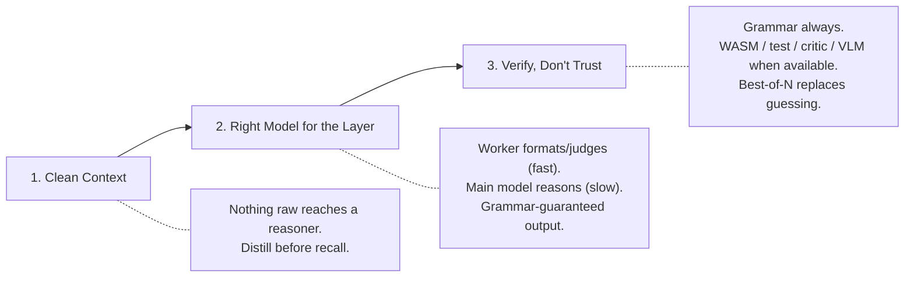

# Sunshine

[](./LICENSE)

A **model-agnostic substrate** for running small local LLMs well. One small-but-capable main model + one tiny fast worker, wired so either swaps out without touching anything else. Code agents, home chat, image/video, real-time speech — on commodity or idle GPUs.

> **Default stack:** Qwen3.5-4B (main) + Qwen3.5-0.8B (worker), backend 1cat-vLLM (pluggable).

---

## The 3 Laws

Every component obeys these. A change that violates a law is wrong by construction.



| Law | Rule |
|---|---|
| **Clean Context** | Nothing raw reaches a reasoner. Web pages, traces, images, long docs are distilled into clean, generic form before recall. |
| **Right Model for the Layer** | The worker routes / distills / formats / judges (never reasons). The main model reasons (never hand-formats). Structured output is grammar-constrained. |
| **Verify, Don't Trust** | Every output is checked by a cheap verifier: grammar always; WASM / unit-test / critic / VLM-judge when available. Best-of-N search replaces guessing. |

---

## The 5 Organs + Kernel

```
┌─────────────────────────────────────────────────────┐
│                     KERNEL                          │
│            (orchestration library)                  │
│   universal loop + 3 laws + best-of-N + budget     │
├──────────┬──────────┬──────────┬────────────────────┤
│ MEMORY   │  FAST    │  REASON  │  VERIFY            │
│ MiniLM/  │  Worker  │  Main    │  WASM / unit-test  │
│ RaBitQ   │  gateway │  model   │  critic / VLM      │
│          │  swarm   │          │  judge             │
└──────────┴──────────┴──────────┴────────────────────┘
```

- **Memory** — Namespaced corpora (user-facts, conversations, agent-traces, recipes, code, distilled-lessons). Distill-on-write.
- **Fast** — Tiny worker gateway. Grammar-constrained ops (route, distill, act, judge). ~2000 tok/s batched. Swarmable.
- **Reason** — Main model + retrieval-hijack. The expensive step, fed clean.
- **Verify** — Pyodide WASM, unit tests, critic, VLM-judge. `verify(candidate, kind)` / `bestof(candidates, kind)`.
- **Kernel** — Orchestration library implementing the universal loop. Imported by each front-end.

---

## The Universal Loop

Every product runs the same shape:

```
INGEST(modality → text)          # STT, VLM-caption, file-read
  → ROUTE                        # what is this, which skill
  → RECALL(memory + corpus)
  → ACT (fast) or REASON → ACT   # cheap path or expensive path
  → VERIFY / best-of-N           # prune where a verifier exists
  → EMIT(text → modality)        # TTS, image params, tool-call
```

**Every product = kernel + 3 knobs:** swap the **corpus**, the **grammar**, the **verifier**.

| Front-end | Corpus | Grammar | Verifier |
|---|---|---|---|
| **Agent** (code/terminal) | traces + recipes | tool-call | WASM + exec |
| **Chat** (home) | user-facts + convo | answer / tags | critic |
| **Studio** (image/video) | prompt + asset exemplars | gen-params | VLM-judge |
| **Voice** (real-time speech) | chat corpus | answer | critic, latency-budgeted |

---

## Quick Start

```bash
# 1. Clone
git clone https://github.com/your-org/sunshine.git
cd sunshine

# 2. Configure
cp .env.example .env
# Edit .env — set model paths, GPU settings, secrets

# 3. Launch
docker compose up -d

# 4. Verify
curl http://localhost:8094/health   # kernel
curl http://localhost:8090/health   # memory
curl http://localhost:8091/health   # fast
```

---

## Project Layout

```
ARCHITECTURE.md        source of truth (3 laws, 7 primitives, 5 organs, loop)
config/models.yaml     role → model → backend registry
organs/                memory · fast · reason · verify · kernel
frontends/             agent · chat · studio · voice
peripherals/           image/video/speech model adapters
edge/                  searxng · cloudflared · open-webui (configs)
```

---

## Architecture

**Read [`ARCHITECTURE.md`](./ARCHITECTURE.md) — it is the source of truth.** It covers the 3 laws, 7 primitives (RECALL, DISTILL, ROUTE, ACT, JUDGE, REASON, VERIFY), the model-agnostic backend, and the migration plan.

---

## The Thesis

**Spend abundance to make scarcity rare and well-fed.** Semantic recall (MiniLM) and the tiny-worker swarm (grammar-constrained, ~2000 tok/s batched) are nearly free on idle GPU. Deep reasoning (the main model) is the scarce, slow thing. So spend the cheap stuff lavishly to ensure the main model **rarely runs** and **never sees raw input**.

---

## License

MIT — see [LICENSE](./LICENSE).
