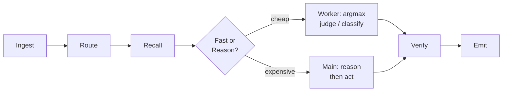
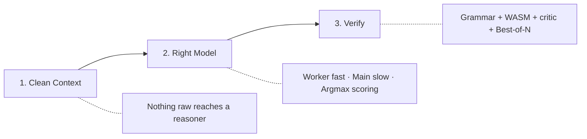
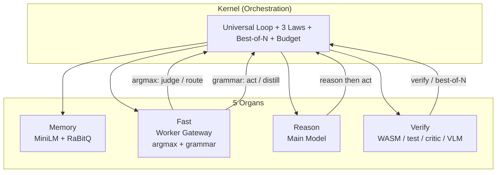

# Sunshine

[](./LICENSE)
[](./docker-compose.yml)
[]()

> **Structured decisions don't need text generation.**

Sunshine is a **model-agnostic substrate** for running small local LLMs well. One small-but-capable main model + one tiny fast worker, wired so either swaps out without touching anything else. Code agents, home chat, image/video, real-time speech — on commodity or idle GPUs.

**Default stack:** Qwen3.5-4B (main) + Qwen3.5-0.8B (worker), backend 1cat-vLLM (pluggable).

## Table of Contents

- [How It Works](#how-it-works)
- [The 3 Laws](#the-3-laws)
- [Features](#features)
- [Architecture](#architecture)
- [Quick Start](#quick-start)
- [The Universal Loop](#the-universal-loop)
- [Project Layout](#project-layout)
- [Contributing](#contributing)
- [License](#license)

## How It Works



The fast organ does a **single forward pass + argmax over logprobs** — no JSON generation, no grammar enforcement, no parsing failures. The model scores options, argmax picks the winner, calibrated probabilities come free.

## The 3 Laws

Every component obeys these. A change that violates a law is wrong by construction.

| Law | Rule |
|---|---|
| **Clean Context** | Nothing raw reaches a reasoner. Web pages, traces, images, long docs are distilled into clean, generic form before recall. |
| **Right Model for the Layer** | The worker routes / distills / formats / judges (never reasons). The main model reasons (never hand-formats). |
| **Verify, Don't Trust** | Every output is checked by a cheap verifier: grammar always; WASM / unit-test / critic / VLM when available. Best-of-N replaces guessing. |



## Features

| Feature | Description |
|---|---|
| **Argmax Scoring** | Single forward pass + argmax over logprobs for routing, judging, classifying — no text generation needed |
| **Model-Agnostic Backend** | Swap models via config: vLLM, llamacpp, OpenAI-compatible. Default Qwen3.5-4B + 0.8B |
| **5 Organ Architecture** | Memory, Fast, Reason, Verify, Kernel — each swappable independently |
| **Distill-on-Write** | Worker distills raw inputs into clean, generic form at write time. Reasoners never see noise |
| **Best-of-N Search** | Generate N candidates, verify and score each, pick the best. Replaces single-shot guessing |
| **Grammar Constraints** | Constrained JSON output when argmax scoring isn't the right tool |
| **Universal Loop** | Every product runs the same INGEST → ROUTE → RECALL → ACT → VERIFY → EMIT shape |
| **Docker Compose** | Memory, Fast, Reason, Verify — each a container, all orchestrated |
| **Semantic Recall** | MiniLM + RaBitQ namespaced corpora for cheap, fast retrieval |

## Architecture



**Default stack:** Qwen3.5-4B (main) + Qwen3.5-0.8B (worker), served on 1cat-vLLM.

Read [`ARCHITECTURE.md`](./ARCHITECTURE.md) — it is the source of truth.

## Quick Start

```bash
# 1. Clone and configure
git clone https://github.com/jajmangold/sunshine.git
cd sunshine
cp .env.example .env

# 2. Launch
docker compose up -d

# 3. Verify
curl http://localhost:8094/health   # kernel
curl http://localhost:8090/health   # memory
curl http://localhost:8091/health   # fast
```

## The Universal Loop

Every product runs the same shape:

```
INGEST → ROUTE → RECALL → ACT/REASON → VERIFY → EMIT
```

**Every product = kernel + 3 knobs:** swap the **corpus**, the **grammar**, the **verifier**.

| Front-end | Corpus | Grammar | Verifier |
|---|---|---|---|
| **Agent** (code/terminal) | traces + recipes | tool-call | WASM + exec |
| **Chat** (home) | user-facts + convo | answer / tags | critic |
| **Studio** (image/video) | prompt + asset exemplars | gen-params | VLM-judge |
| **Voice** (real-time speech) | chat corpus | answer | critic, latency-budgeted |

## Project Layout

```
config/models.yaml     role → model → backend registry
organs/                memory · fast · reason · verify · kernel
frontends/             agent · chat · studio · voice
peripherals/           image/video/speech model adapters
edge/                  searxng · cloudflared · open-webui (configs)
```

## Contributing

1. Fork the repo
2. Create a feature branch
3. Make changes and add tests
4. Run `docker compose up` to verify
5. Open a PR

See [`ARCHITECTURE.md`](./ARCHITECTURE.md) for the design source of truth.

## License

MIT — see [LICENSE](./LICENSE).
