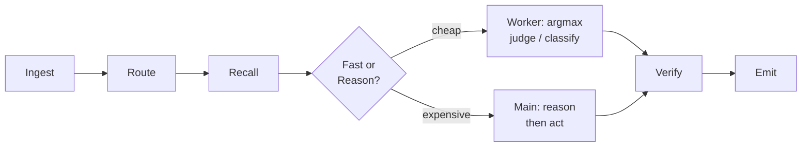
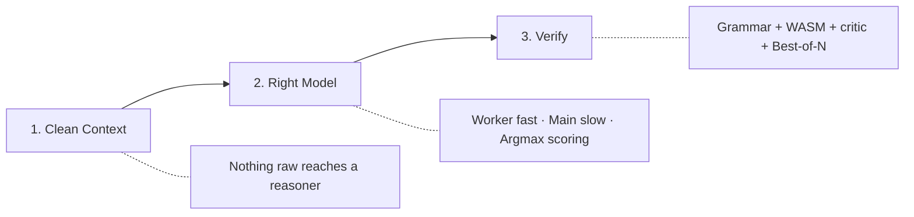
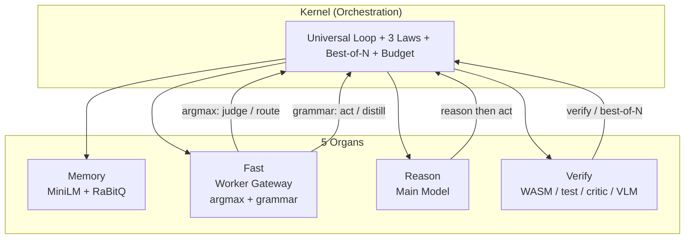

# Sunshine

[](./LICENSE)
[](./docker-compose.yml)
[]()
[]()

> **Structured decisions don't need text generation.**

Sunshine is a **model-agnostic substrate** for running small local LLMs well. One small-but-capable main model + one tiny fast worker, wired so either swaps out without touching anything else. Code agents, home chat, image/video, real-time speech — on commodity or idle GPUs.

**Default stack:** Qwen3.5-4B (main) + Qwen3.5-0.8B (worker), backend 1cat-vLLM (pluggable).

## Why Sunshine

The industry is converging on one pattern from four different directions. Sunshine is the only project that implements all of them natively.

| Trend | What It Says | Sunshine Already Has It |
|-------|-------------|------------------------|
| **Jev** (TypeSafe AI) | "System One models" — don't generate text, score typed decisions in one forward pass | Fast organ: argmax over logprobs, calibrated probabilities, no JSON |
| **Laya** (Convai Innovations) | Open-source 421M decision model, 32.8ms latency, beats Jev on benchmarks | Fast organ: same pattern, swappable backend |
| **SemIf** | Read logits directly instead of generating JSON — 5.21x faster | Fast organ: logprobs → softmax → argmax, zero output tokens |
| **Needle** (Cactus Compute) | "Tool calling is retrieval-and-assembly, not reasoning — throw away FFNs" | Fast organ: lightweight scoring, reason organ handles real reasoning |
| **Gemma 4 E2B/E4B** | Edge models with native function calling, 2.3B effective params | Model-agnostic: swap in any backend, any model |
| **Qwen3.5-4B** | 19.7M downloads, 262K context, tool calling, structured output | Default main model, proven on this architecture |

The pattern: **80% of agent calls are short, structured, and routine. Route, classify, extract, judge.** You don't need a frontier model for those. You need a scoring engine that picks the right option in one pass.

Sunshine's fast organ does exactly that. The reason organ handles the 20% that needs real thinking. The kernel orchestrates the loop. The memory and verify organs keep it honest.

```
                    What everyone else is building        What Sunshine already is
                    ─────────────────────────────        ──────────────────────────
                    "Prompt LLM, parse JSON"      →      Argmax scoring, no generation
                    "Small-first routing"         →      Fast/Reason organ split
                    "Structured output"           →      Logprobs + softmax + argmax
                    "Verify don't trust"          →      Best-of-N + WASM + critic
                    "Tiny models for agents"      →      Qwen3.5-0.8B worker, swappable
```

## Table of Contents

- [How It Works](#how-it-works)
- [The 3 Laws](#the-3-laws)
- [Features](#features)
- [Architecture](#architecture)
- [Quick Start](#quick-start)
- [The Universal Loop](#the-universal-loop)
- [Project Layout](#project-layout)
- [Contributing](#contributing)
- [License](#license)

## How It Works



The fast organ does a **single forward pass + argmax over logprobs** — no JSON generation, no grammar enforcement, no parsing failures. The model scores options, argmax picks the winner, calibrated probabilities come free.

## The 3 Laws

Every component obeys these. A change that violates a law is wrong by construction.

| Law | Rule |
|---|---|
| **Clean Context** | Nothing raw reaches a reasoner. Web pages, traces, images, long docs are distilled into clean, generic form before recall. |
| **Right Model for the Layer** | The worker routes / distills / formats / judges (never reasons). The main model reasons (never hand-formats). |
| **Verify, Don't Trust** | Every output is checked by a cheap verifier: grammar always; WASM / unit-test / critic / VLM when available. Best-of-N replaces guessing. |



## Features

| Feature | Description |
|---|---|
| **Argmax Scoring** | Single forward pass + logprobs → softmax → argmax. No text generation, no JSON parsing. Calibrated probabilities for free |
| **Two Scoring Modes** | Argmax for route/judge/classify (fast path). Grammar-constrained JSON for act/distill (unbounded output) |
| **Model-Agnostic Backend** | Swap models via config: vLLM, llamacpp, OpenAI-compatible. Default Qwen3.5-4B + 0.8B — or Gemma 4, SmolLM3, any SLM |
| **5 Organ Architecture** | Memory · Fast · Reason · Verify · Kernel — each swappable independently |
| **Distill-on-Write** | Worker distills raw inputs into clean, generic form at write time. Reasoners never see noise |
| **Best-of-N Search** | Generate N candidates, verify and score each, pick the best. Replaces single-shot guessing |
| **Universal Loop** | Every product runs the same INGEST → ROUTE → RECALL → ACT → VERIFY → EMIT shape |
| **Semantic Recall** | MiniLM + RaBitQ namespaced corpora for cheap, fast retrieval |
| **Docker Compose** | Memory, Fast, Reason, Verify — each a container, all orchestrated |

## Architecture



**Default stack:** Qwen3.5-4B (main) + Qwen3.5-0.8B (worker), served on 1cat-vLLM.

Read [`ARCHITECTURE.md`](./ARCHITECTURE.md) — it is the source of truth.

## Quick Start

```bash
# 1. Clone and configure
git clone https://github.com/jajmangold/sunshine.git
cd sunshine
cp .env.example .env

# 2. Launch
docker compose up -d

# 3. Verify
curl http://localhost:8094/health   # kernel
curl http://localhost:8090/health   # memory
curl http://localhost:8091/health   # fast
```

## Argmax vs Grammar: When to Use Which

The fast organ auto-selects the scoring method based on the operation:

| Operation | Method | Why |
|-----------|--------|-----|
| **Route** (pick one option) | Argmax | Fixed option set, one forward pass, no generation |
| **Judge** (true/false) | Argmax | Binary decision, logprobs over "true"/"false" tokens |
| **Act** (tool call) | Grammar | Unbounded command string needs constrained generation |
| **Distill** (summarize) | Grammar | Free-form text output needs generation |

Override with `method=argmax` or `method=grammar` on any request.

## Evidence: The Ablation Ladder

Sunshine ships with a 9-task eval suite and a systematic ablation ladder. Each rung must measurably lift the curve or it's cut.

| Rung | What It Adds | Baseline → With Rung | Key Metric |
|------|-------------|---------------------|------------|
| **0** | Bare grammar tool-calls | 2/6 tests, 361s | Reliable format, weak behavior |
| **1** | Loop detection | **2/6 → 5/6**, 361s → **24s** | Escapes infinite loops, regenerates |
| **2** | Repo map (structural context) | 0/3 → **2/3** | 4B traces call-structure to find bugs |
| **3** | Gated recall (lessons) | 0/3 → **3/3** | Injects un-derivable facts, fewer tokens |
| **4** | Output shaper (structured edits) | Valid edits + apply-verify | Write operations succeed |
| **5** | Verify / best-of-N | 50% → **100%** | N tries + cheap checker = reliable |

**The thesis in one number:** "Verifying is cheaper than generating." N tries + a cheap checker converts UNRELIABLE → RELIABLE. Single attempt = 50% solve rate. Best-of-3 with verify = 100%.

**Knowledge vs reasoning injection** (measured, not guessed):

| Task Type | Best Channel | Result |
|-----------|-------------|--------|
| Facts (sha256-gated key) | System note | 0/3 → 3/3 |
| Facts | `<think>` hijack | 0/3 (corrupted) |
| Strategy (non-obvious approach) | System note | 0/3 → 3/3 |
| Strategy | `<think>` hijack | 1/3 |

System notes beat think-prefill for both facts and strategies in the grammar backend. Right mechanism, right architecture.

See [`eval/results/ladder.md`](eval/results/ladder.md) for full ablation data.

## The Universal Loop

Every product runs the same shape:

```
INGEST → ROUTE → RECALL → ACT/REASON → VERIFY → EMIT
```

**Every product = kernel + 3 knobs:** swap the **corpus**, the **grammar**, the **verifier**.

| Front-end | Corpus | Grammar | Verifier |
|---|---|---|---|
| **Agent** (code/terminal) | traces + recipes | tool-call | WASM + exec |
| **Chat** (home) | user-facts + convo | answer / tags | critic |
| **Studio** (image/video) | prompt + asset exemplars | gen-params | VLM-judge |
| **Voice** (real-time speech) | chat corpus | answer | critic, latency-budgeted |

## Project Layout

```
config/models.yaml     role → model → backend registry
organs/                memory · fast · reason · verify · kernel
frontends/             agent · chat · studio · voice
peripherals/           image/video/speech model adapters
edge/                  searxng · cloudflared · open-webui (configs)
```

## Contributing

1. Fork the repo
2. Create a feature branch
3. Make changes and add tests
4. Run `docker compose up` to verify
5. Open a PR

See [`ARCHITECTURE.md`](./ARCHITECTURE.md) for the design source of truth.

## License

MIT — see [LICENSE](./LICENSE).
